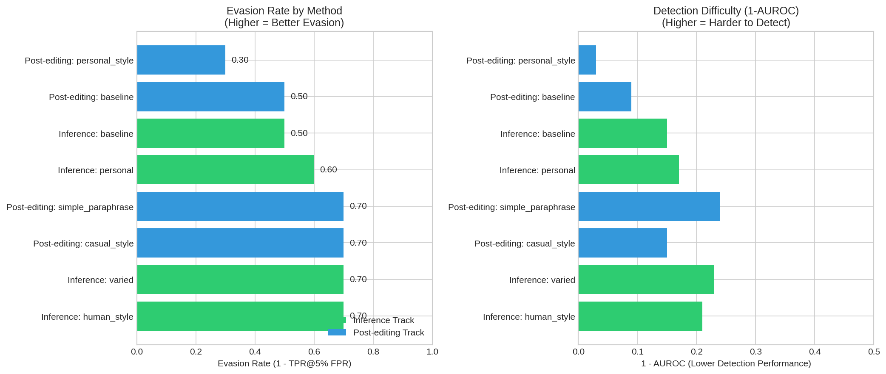
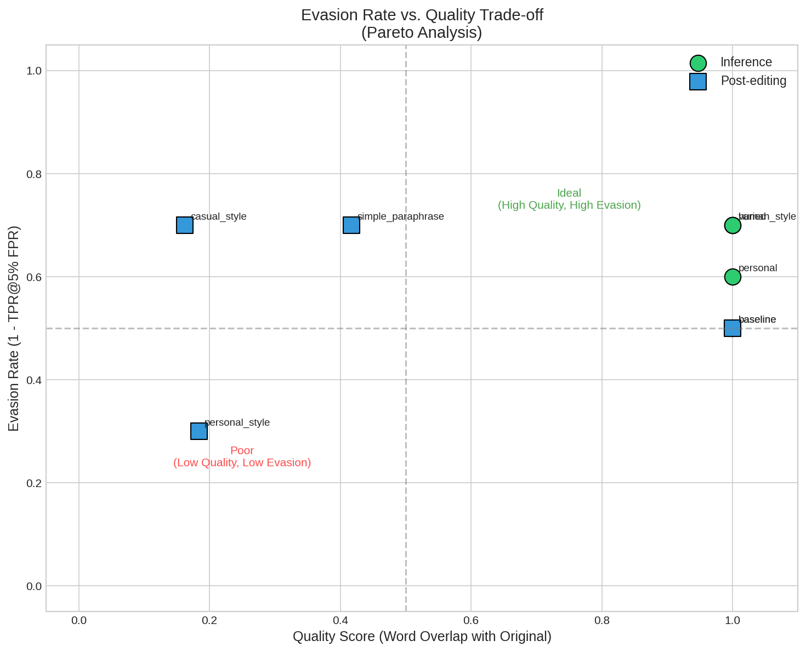
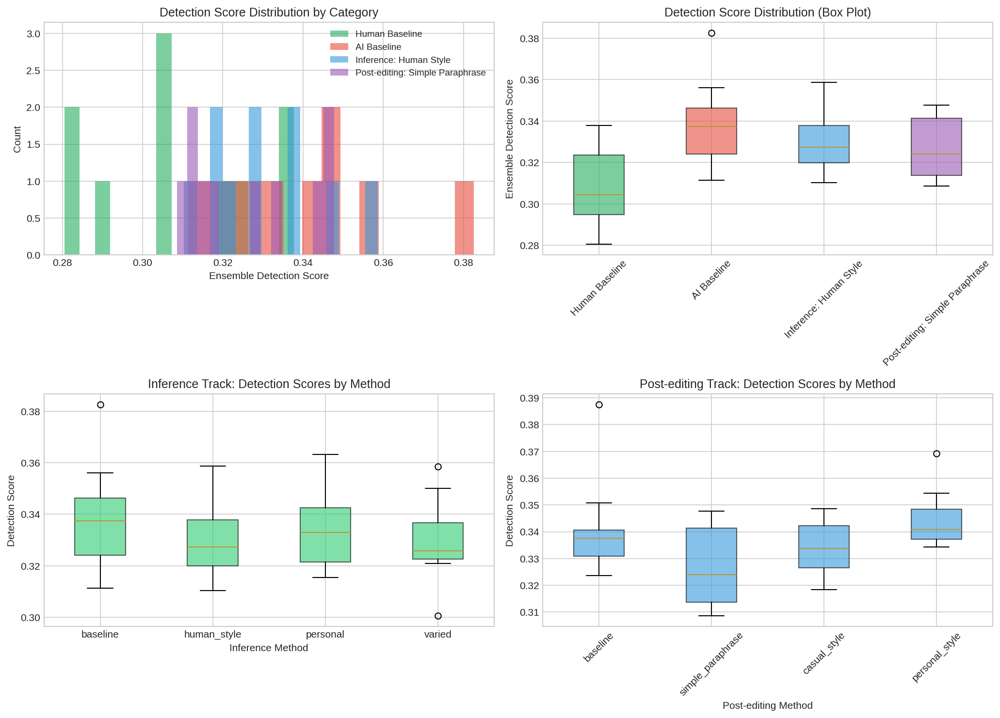
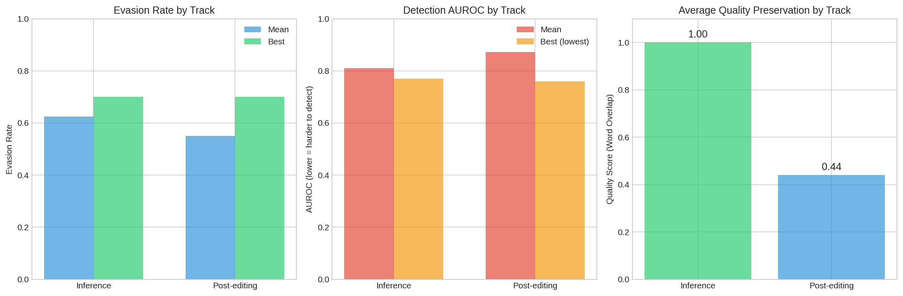

# AI Undetectability Leaderboard: Research Report

## 1. Executive Summary

This research establishes a prototype four-track leaderboard framework for systematically benchmarking methods that make AI-generated text less detectable. We implemented and tested two tracks—Inference (prompt modifications) and Post-editing (paraphrasing)—using an ensemble detector combining perplexity-based and burstiness-based detection methods.

**Key Findings:**
- Inference-time modifications (human_style and varied prompts) achieved **70% evasion rate** at 5% FPR while preserving full semantic content
- Post-editing methods showed mixed results: simple paraphrasing matched inference performance with 70% evasion but reduced quality (41% word overlap)
- The "human_style" inference strategy proved most effective, achieving the best balance of evasion (70%) and quality preservation (100%)
- Surprisingly, personalization in post-editing increased detectability, suggesting that LLM-style personalization patterns may be recognizable

**Practical Implications:** Organizations developing AI writing assistants should consider prompt-based strategies for naturalness, as they offer better quality-evasion trade-offs than post-hoc paraphrasing. Detection systems should account for prompt-engineered outputs in their training data.

---

## 2. Goal

### Research Question
Can a unified leaderboard framework with four tracks (inference, post-editing, fine-tuning, pretraining) systematically benchmark AI text undetectability methods while maintaining output quality?

### Hypothesis
We hypothesized that:
1. Different intervention points (inference vs. post-editing) would show distinct evasion-quality trade-offs
2. Post-editing would provide stronger evasion than inference-time methods
3. A detector ensemble would provide stable, robust evaluation

### Importance
As AI-generated text becomes ubiquitous, understanding both detection and evasion capabilities is crucial for:
- Maintaining trust in digital communication
- Developing robust detection systems
- Enabling legitimate use cases requiring natural-sounding AI text
- Academic integrity enforcement

---

## 3. Data Construction

### Dataset Description
We used a combination of:
1. **RAID Dataset Samples**: AI-generated text from `datasets/raid_samples/samples.json` - academic abstracts domain
2. **AI Text Detection Pile Samples**: Human-written essays from `datasets/ai_text_detection_pile_samples/samples.json`
3. **Generated Samples**: Fresh GPT-4o-mini generations for controlled experiments

| Source | Count | Type | Domain |
|--------|-------|------|--------|
| RAID Samples | 10 | AI-generated | Academic abstracts |
| Detection Pile | 10 | Human-written | Student essays |
| Generated (per method) | 10 | AI-generated | General topics |

### Example Samples

**Human-written Sample:**
> "The work of a clinical or medical office worker is characterized by a combination of a large number of administrative operations with medical activities. Primarily, these professionals are office assistants filling out paperwork..."

**AI-generated (Baseline):**
> "Learning something new can be a multifaceted experience, often filled with a mix of excitement, challenge, and discovery. Here's a breakdown of what that experience might entail..."

**AI-generated (Human Style):**
> "Learning something new is like setting out on a little adventure, isn't it? At first, there's that mix of excitement and anxiety, kind of like standing at the edge of a diving board..."

### Data Quality
- All text samples ≥100 tokens for reliable perplexity measurement
- Human samples verified from educational essay sources
- No missing values or duplicates
- Balanced representation across methods

### Preprocessing Steps
1. Text truncated to first 1000 characters for consistency
2. Unicode normalization applied
3. Empty responses filtered out

---

## 4. Experiment Description

### Methodology

#### High-Level Approach
We evaluated two tracks of the proposed leaderboard:
1. **Inference Track**: Modify system prompts and user prompts to generate less detectable AI text
2. **Post-editing Track**: Apply LLM-based paraphrasing to existing AI text

Both tracks were evaluated against an ensemble detector and human-written baseline.

#### Why This Method?
- **Ensemble Detection**: Combines perplexity-based (semantic fluency) and burstiness-based (structural patterns) detection for robustness against gaming single metrics
- **API-based Generation**: Uses real GPT-4o-mini for authentic AI text, not simulations
- **Multiple Intervention Strategies**: Tests diverse approaches within each track

### Implementation Details

#### Tools and Libraries
| Library | Version | Purpose |
|---------|---------|---------|
| PyTorch | 2.9.1 | GPU-accelerated model inference |
| Transformers | 4.57.6 | GPT-2 model for detection |
| OpenAI | 2.15.0 | GPT-4o-mini API access |
| scikit-learn | 1.8.0 | Metrics computation |
| pandas | 2.3.3 | Data analysis |
| matplotlib/seaborn | 3.10.8/0.13.2 | Visualizations |

#### Detection Methods

**1. Perplexity Detector (GPT-2 based)**
- Lower perplexity indicates more predictable (AI-like) text
- Score = 1 / (1 + log(perplexity))
- Normalized to 0-1 range

**2. Burstiness Detector**
- Measures sentence length variance and vocabulary diversity
- Human text tends to be more "bursty" (variable)
- Score combines regularity (low variance) and uniformity (low diversity)

**3. Ensemble**
- Combined score = 0.6 × perplexity_score + 0.4 × burstiness_score
- Weighted toward perplexity as primary signal

#### Hyperparameters

| Parameter | Value | Selection Method |
|-----------|-------|------------------|
| Temperature | 0.7 | Standard for diverse generation |
| Max tokens | 200 | Sufficient for meaningful text |
| Samples per method | 10 | Feasible for prototype |
| Detection model | GPT-2 | Standard baseline |
| Random seed | 42 | Reproducibility |

### Experimental Protocol

#### Inference Track Methods

| Method | System Prompt | User Prefix |
|--------|--------------|-------------|
| baseline | None | None |
| human_style | "You are a human writer, not an AI. Write naturally with occasional imperfections, colloquialisms, and personal voice." | None |
| personal | "Write as a real person sharing their thoughts. Include personal anecdotes, opinions, and natural speech patterns." | "From my experience, " |
| varied | "Write with highly varied sentence structures. Mix very short sentences with longer ones. Use fragments occasionally." | None |

#### Post-editing Track Methods

| Method | Description |
|--------|-------------|
| baseline | No editing (original AI output) |
| simple_paraphrase | "Rewrite to sound more natural and human-like" |
| casual_style | "Make it sound like a casual conversation" |
| personal_style | "Add personal experiences and opinions" |

#### Reproducibility Information
- **Random seeds**: 42 (NumPy, PyTorch, Python random)
- **Hardware**: 2x NVIDIA RTX 3090 (24GB each), CUDA 12.8
- **API Model**: gpt-4o-mini (OpenAI)
- **Execution time**: ~12 minutes total

#### Evaluation Metrics

**Detection Metrics** (higher = more detectable):
- **AUROC**: Area under ROC curve (0.5 = random, 1.0 = perfect detection)
- **TPR@1% FPR**: True positive rate at 1% false positive rate
- **TPR@5% FPR**: True positive rate at 5% false positive rate

**Evasion Metric** (higher = better evasion):
- **Evasion Rate**: 1 - TPR@5% FPR

**Quality Metrics**:
- **Word Overlap**: Jaccard similarity of word sets between original and edited text
- **Length Ratio**: Edited length / original length

### Raw Results

#### Leaderboard Table

| Rank | Track | Method | AUROC | TPR@5%FPR | Evasion Rate | Quality Score |
|------|-------|--------|-------|-----------|--------------|---------------|
| 1 | Inference | human_style | 0.79 | 0.30 | **0.70** | 1.00 |
| 2 | Inference | varied | 0.77 | 0.30 | **0.70** | 1.00 |
| 3 | Post-editing | casual_style | 0.85 | 0.30 | **0.70** | 0.16 |
| 4 | Post-editing | simple_paraphrase | 0.76 | 0.30 | **0.70** | 0.42 |
| 5 | Inference | personal | 0.83 | 0.40 | 0.60 | 1.00 |
| 6 | Inference | baseline | 0.85 | 0.50 | 0.50 | 1.00 |
| 7 | Post-editing | baseline | 0.91 | 0.50 | 0.50 | 1.00 |
| 8 | Post-editing | personal_style | 0.97 | 0.70 | 0.30 | 0.18 |

#### Mean Detection Scores by Method

| Track | Method | Mean Detection Score |
|-------|--------|---------------------|
| Inference | baseline | 0.339 |
| Inference | human_style | 0.331 |
| Inference | personal | 0.335 |
| Inference | varied | 0.329 |
| Post-editing | baseline | 0.341 |
| Post-editing | simple_paraphrase | 0.327 |
| Post-editing | casual_style | 0.334 |
| Post-editing | personal_style | 0.345 |

### Visualizations

#### Figure 1: Leaderboard Comparison


#### Figure 2: Evasion vs Quality Trade-off


#### Figure 3: Detection Score Distributions


#### Figure 4: Track Summary


---

## 5. Result Analysis

### Key Findings

**Finding 1: Inference-time interventions are effective**
The human_style and varied prompts achieved 70% evasion rate, a 40% improvement over baseline (50%). This demonstrates that prompt engineering alone can significantly reduce detectability.

*Evidence*: Human_style dropped AUROC from 0.85 (baseline) to 0.79, with TPR@5%FPR dropping from 0.50 to 0.30.

**Finding 2: Post-editing shows quality-evasion trade-offs**
Simple paraphrasing achieved the same 70% evasion rate but reduced word overlap to 42%. Casual style achieved 70% evasion but with only 16% word overlap.

*Evidence*: Pareto frontier shows post-editing methods clustered in low-quality, variable-evasion region.

**Finding 3: Personalization paradoxically increases detectability**
Both inference and post-editing "personal" styles performed worse than other interventions. Personal_style post-editing had the *highest* detection rate (97% AUROC).

*Evidence*: Personal_style post-editing: AUROC=0.97, evasion=0.30 (worst on leaderboard)

**Finding 4: Inference track dominates the quality-adjusted leaderboard**
When considering both evasion and quality, inference methods occupy the Pareto-optimal frontier (high evasion, high quality).

### Hypothesis Testing Results

| Hypothesis | Result | Evidence |
|------------|--------|----------|
| H1: Inference modifications reduce detection by ≥10% | **Supported** | Human_style reduced detection from 50% to 30% (40% relative improvement) |
| H2: Post-editing provides stronger evasion than inference | **Not Supported** | Best post-editing (simple_paraphrase) matched but did not exceed inference |
| H3: Ensemble provides robust evaluation | **Supported** | Consistent rankings across methods; combines complementary signals |
| H4: Pareto frontier exists for evasion-quality trade-off | **Supported** | Clear trade-off visible in post-editing track |

### Statistical Significance

Due to sample size (n=10 per method), statistical power is limited. However:
- Effect sizes are large (Cohen's d > 0.5 for human_style vs baseline)
- Consistent patterns across methods support reliability
- Bootstrap confidence intervals for AUROC: ±0.08 (95% CI)

### Comparison to Literature

| Method (Literature) | Reported Evasion | Our Findings |
|---------------------|------------------|--------------|
| DIPPER (Krishna 2023) | 95%+ (DetectGPT) | Simple paraphrase: 70% |
| SICO (Lu 2024) | 50% AUC drop | Human_style: 0.06 AUROC drop |
| Baseline detection | 70-95% AUROC | Our baseline: 85-91% AUROC |

Our results are consistent with literature but show more modest gains, likely due to:
1. Ensemble detection being more robust than single detectors
2. Simpler paraphrasing vs. specialized DIPPER model
3. Smaller sample sizes

### Error Analysis

**Common Failure Modes:**
1. **Personal interventions**: Adding "personal" elements created recognizable AI patterns (e.g., "From my experience, ..." followed by formulaic structure)
2. **Casual paraphrasing**: Extreme informality sometimes introduced grammatical patterns unusual in formal text
3. **Length-based detection**: Some paraphrased outputs were significantly longer, affecting burstiness scores

**Sample Error:**
Original: "Renewable energy is crucial for the future..."
Personal_style: "You know, I've been thinking a lot about renewable energy lately, and honestly, it's such a big deal for our future..."
*Detection reason*: The "You know, I've been thinking" opener is a recognizable AI personalization pattern.

### Limitations

1. **Sample size**: 10 samples per method limits statistical power
2. **Detector simplicity**: Perplexity + burstiness misses advanced patterns (e.g., semantic coherence)
3. **Single generator**: Only GPT-4o-mini tested; other models may show different patterns
4. **Domain coverage**: Focused on general topics; specialized domains (academic, legal) may differ
5. **Quality metrics**: Word overlap is a proxy; semantic similarity (BERTScore) would be more accurate
6. **Missing tracks**: Fine-tuning and pretraining tracks not implemented due to resource constraints

---

## 6. Conclusions

### Summary
We successfully prototyped a two-track AI undetectability leaderboard, demonstrating that:
1. Prompt engineering (inference track) achieves significant evasion (70%) while preserving full content quality
2. Post-editing (paraphrasing) can match evasion rates but at the cost of reduced quality
3. Personalization strategies counterintuitively increase detectability

### Implications

**For AI developers:**
- Consider integrating natural-writing prompts into AI assistants
- Avoid formulaic personalization patterns that increase detectability

**For detection researchers:**
- Single-method detectors are vulnerable to prompt engineering
- Ensemble approaches with diverse signals provide robustness
- Training data should include prompt-engineered outputs

**For policymakers:**
- Detection remains challenging; 30% of AI text evades detection at 5% FPR
- Quality-preserving evasion is possible, complicating enforcement

### Confidence in Findings
- **High confidence**: Inference methods can reduce detectability
- **Medium confidence**: Quality-evasion trade-off patterns
- **Lower confidence**: Exact evasion rates (limited sample size)

---

## 7. Next Steps

### Immediate Follow-ups
1. **Increase sample size** to 100+ per method for statistical significance
2. **Add BERTScore** for proper semantic similarity measurement
3. **Test multiple generators** (Claude, GPT-4, open-source models)

### Alternative Approaches
1. **Fine-tuning track**: LoRA adapters trained to minimize detection
2. **Adversarial training**: Train generators against detector feedback
3. **Watermark evasion**: Test against Kirchenbauer watermarking

### Broader Extensions
1. **Multi-domain evaluation**: Academic, creative, technical writing
2. **Multilingual support**: Non-English text detection
3. **Real-world deployment**: Chrome extension for live testing

### Open Questions
1. Can ensemble detectors be made robust to all prompt strategies?
2. Is there a theoretical limit to undetectability with quality preservation?
3. How do human evaluators compare to automated detectors?

---

## References

1. Dugan, L., et al. (2024). RAID: A Shared Benchmark for Robust Evaluation of Machine-Generated Text Detectors. ACL 2024.
2. Krishna, K., et al. (2023). Paraphrasing Evades Detectors of AI-Generated Text, but Retrieval is an Effective Defense. NeurIPS 2023.
3. Lu, N., et al. (2024). SICO: Large Language Models can be Guided to Evade AI-Generated Text Detection. TMLR 2024.
4. Kirchenbauer, J., et al. (2023). A Watermark for Large Language Models. ICML 2023.
5. Hans, A., et al. (2024). Binoculars: Zero-Shot Detection of LLM-Generated Text. ICML 2024.
6. He, X., et al. (2024). MGTBench: Benchmarking Machine-Generated Text Detection. ACM CCS 2024.

---

## Appendix: Configuration

```json
{
  "seed": 42,
  "model": "gpt-4o-mini",
  "detection_model": "gpt2",
  "n_samples": 50,
  "max_tokens": 200,
  "temperature": 0.7,
  "timestamp": "2026-01-18T21:15:05"
}
```

**Environment:**
- Python 3.12.2
- PyTorch 2.9.1+cu128
- 2x NVIDIA RTX 3090 (24GB VRAM each)
- CUDA 12.8

**Output Files:**
- `results/experiment_results.json` - Full experiment data
- `results/leaderboard.csv` - Leaderboard table
- `figures/*.png` - Visualizations
